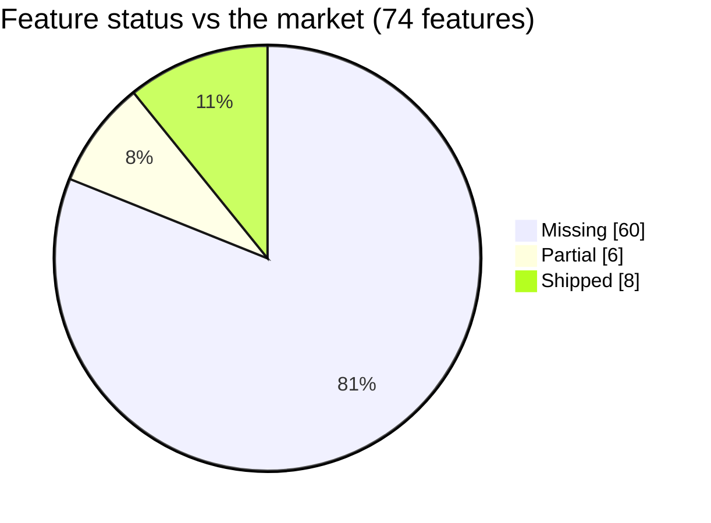
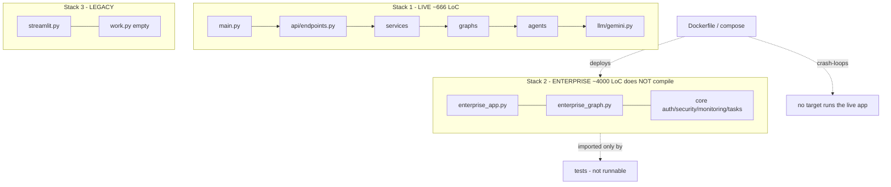
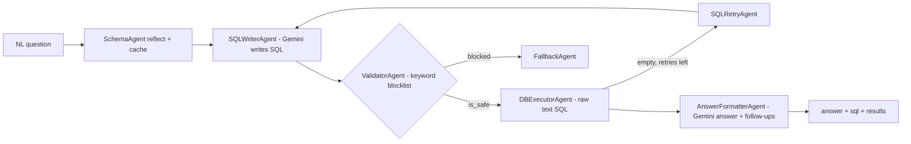
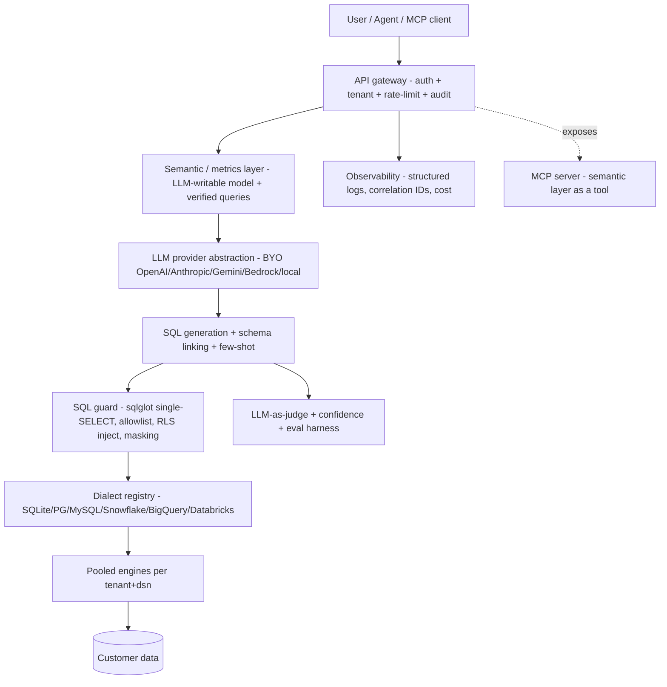
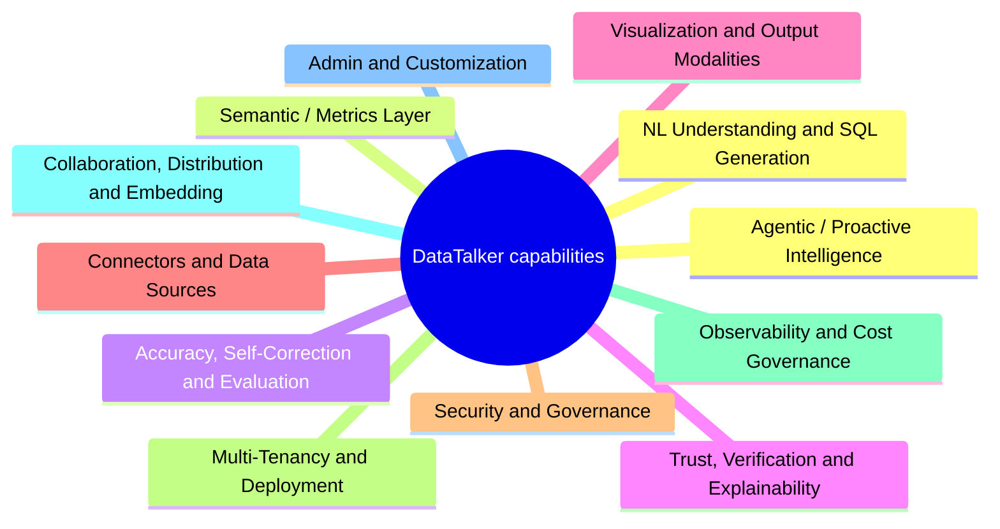
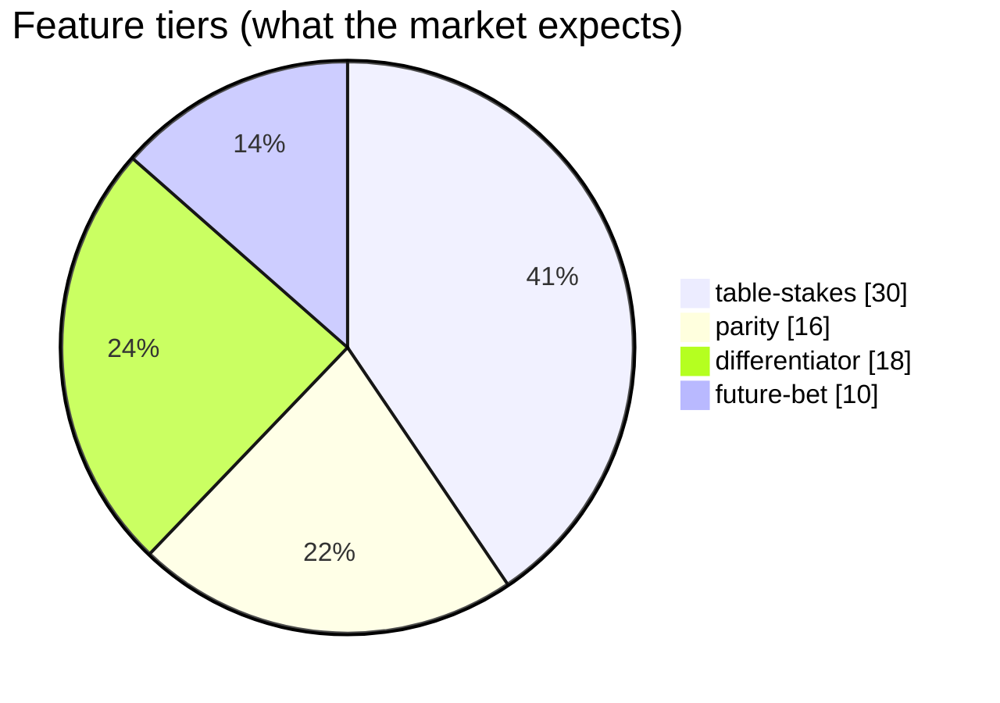
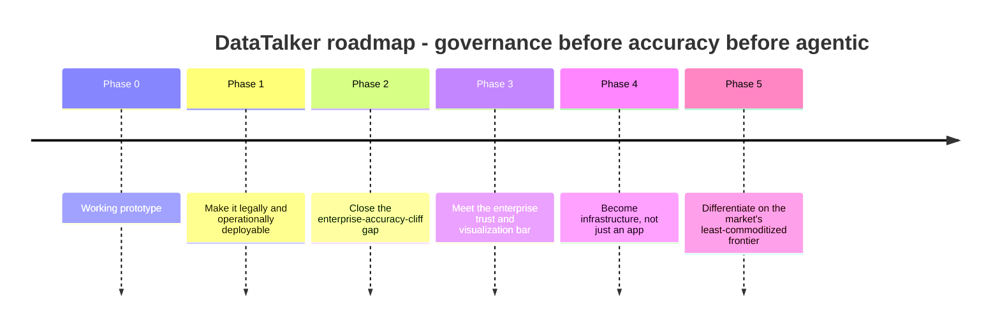
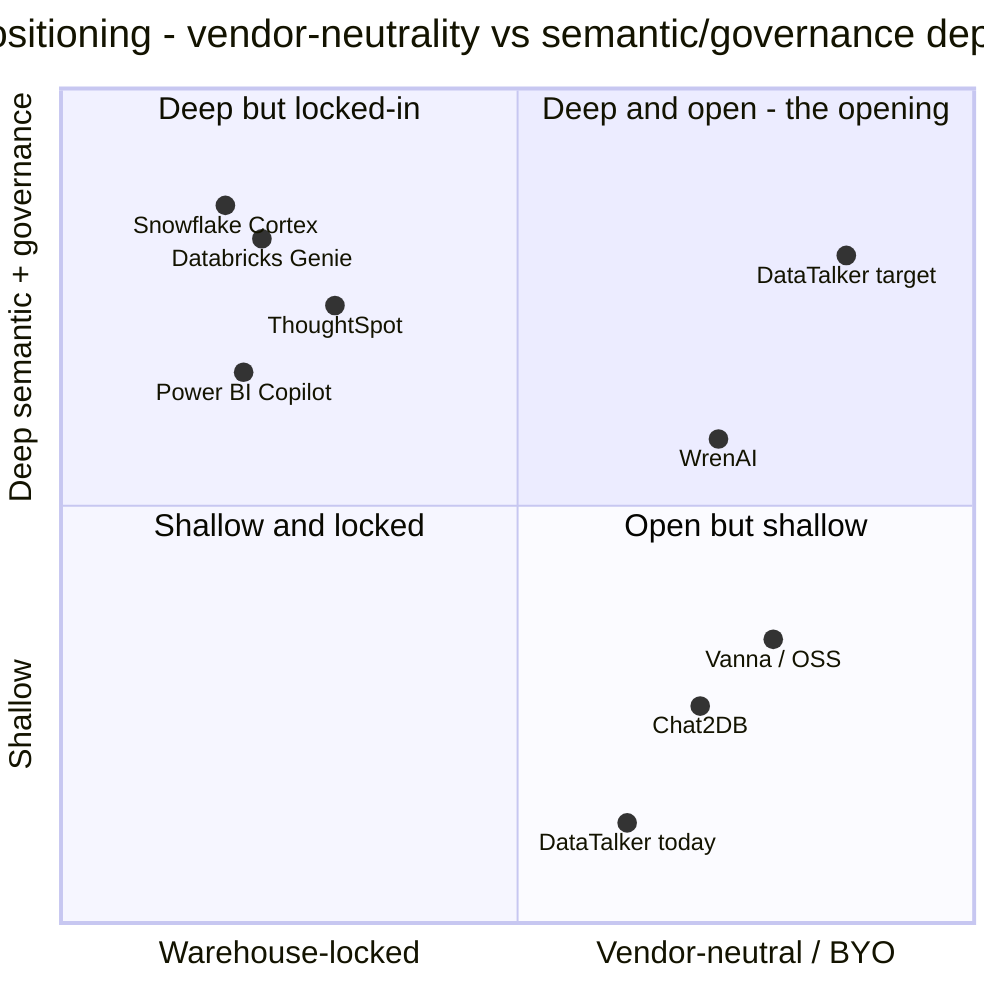

# DataTalker - Strategy Briefing

> Local, offline companion to the audit (`CODEBASE_AUDIT.md`) and the full PRD (`PRD.md`). Same data as the interactive dashboard `prd-briefing.html`, as tables + Mermaid diagrams. Mermaid renders on GitHub, in Obsidian, and in VS Code with a Mermaid preview extension.

**Scope:** 92 products/frameworks/techniques benchmarked - 74 features across 12 capability areas.

---

## 1. The one-screen summary

| Metric | Value | Meaning |
|---|---|---|
| Features shipped | **8 / 74** | ~11% of the market feature space; 60 missing, 6 partial |
| Market benchmarked | **92 products** | across 8 segments |
| Accuracy today | **6-21%** | raw text-to-SQL on real enterprise schemas (Spider 2.0) |
| Accuracy target | **98-100%** | modeled questions via a governed semantic layer |
| Wedge | **Vendor-neutral** | BYO-LLM + BYO-warehouse + MCP-native + open-core + self-host |

## 2. The accuracy cliff (why the semantic layer is the moat)

| Setting | Execution accuracy | Note |
|---|---:|---|
| Academic benchmark (Spider, clean schemas) | 85-91% | looks solved |
| **Real enterprise schema, raw text-to-SQL (Spider 2.0)** | **6-21%** | what DataTalker does today |
| Via a governed semantic layer (NL -> metrics) | 98-100% | the single highest-leverage investment |

_Raw schema-only generation collapses on real schemas; a governed metrics layer recovers it. The semantic layer is the moat, not a feature._

## 3. Current state - three parallel backends (only one runs)

| Stack | Entry | Status |
|---|---|---|
| 1 Live/modular | `main.py` -> api -> services -> graphs -> agents -> gemini | ✅ what actually runs |
| 2 Enterprise | `enterprise_app.py` + `core/{auth,security,monitoring,tasks}` | ❌ ~4000 LoC dead, won't compile |
| 3 Legacy | `streamlit.py`, `work.py` (0 bytes) | ❌ superseded |

## 4. Current NL->SQL pipeline (Stack 1)

_The blocklist is the only safety gate and misses ATTACH / COPY TO PROGRAM / pg_read_file (audit SEC-01); SQL runs as raw `text()` with no read-only enforcement._

## 5. Target architecture (the pillars)

## 6. Capability areas & the feature gap

### Feature tables by capability area

Legend: 🟥 table-stakes (must-have) - 🟧 parity - 🟩 differentiator - 🔮 future-bet - Status = DataTalker today.

#### 6.1 NL Understanding & SQL Generation  `(1/7 shipped)`

_The core generation loop. Table-stakes here is necessary but, per research, insufficient alone - raw schema-only generation is what collapses on real enterprise schemas (6-21% on Spider 2.0), so this category must be read together with the Semantic Layer category, not in isolation._

| Feature | Tier | DataTalker | Who has it |
|---|---|---|---|
| **Zero-shot LLM SQL generation from reflected schema** - Reflect live DB schema and prompt an LLM to write SQL directly against it. | 🟥 Table-stakes | ✅ Shipped | Universal across every product surveyed |
| **Stateful multi-turn conversation** - Resolve follow-up questions ('now by region') against prior turns' tables/filters/context, not just suggest follow-up prompts. | 🟥 Table-stakes | 🟡 Partial | Databricks Genie (improved context handling), ThoughtSpot, Delphina |
| **Pluggable LLM providers (BYO-LLM)** - Swap between OpenAI, Anthropic, Gemini, Bedrock, Azure OpenAI, or local models (Ollama/vLLM) per tenant, not hardwired to one vendor. | 🟥 Table-stakes | ❌ Missing | ThoughtSpot, Sisense, Vanna, WrenAI, DB-GPT - now standard across nearly every serious product |
| **Multi-statement / multi-part question handling** - Correctly decompose and render results for a single NL ask that implies multiple SQL statements. | 🟧 Parity | 🟡 Partial | MAC-SQL, DIN-SQL decomposition patterns; Genie multi-step |
| **Schema linking / pruning for large schemas** - Retrieve only the top-K relevant tables/columns instead of stuffing the whole information_schema into the prompt. | 🟧 Parity | ❌ Missing | LlamaIndex SQLTableRetrieverQueryEngine, CHESS, X-Linking, RASL |
| **Query decomposition into sub-questions/CTEs** - Break a complex analytical question into simpler composable sub-queries before assembling final SQL. | 🟩 Differentiator | ❌ Missing | MAC-SQL Decomposer, DIN-SQL, QDecomp |
| **On-prem fine-tuned SQL-specialist model option** - Offer a small, purpose-built SQL model (SQLCoder/NSQL-class) for fully offline/air-gapped inference as an alternative to any external API call. | 🔮 Future-bet | ❌ Missing | Numbers Station (NSQL), Defog SQLCoder, Chat2DB-SQL-7B |

#### 6.2 Semantic / Metrics Layer  `(0/5 shipped)`

_Per 2026 benchmarks, routing through a governed semantic layer lifts frontier-model accuracy from ~84-90% to 98-100% on modeled questions, versus 6-10% for raw text-to-SQL on real enterprise schemas. This is the single highest-leverage investment in the entire PRD and DataTalker's primary proposed moat._

| Feature | Tier | DataTalker | Who has it |
|---|---|---|---|
| **Business glossary / synonym mapping** - Map business terminology and synonyms ('JD' = 'Jane Doe', 'revenue' = specific column expression) onto physical schema elements. | 🟥 Table-stakes | ❌ Missing | Nearly every semantic-layer vendor |
| **LLM-writable semantic/metrics model** - A human- and LLM-editable model (tables->'models', dimensions, metrics, joins, synonyms) that narrows the LLM's task from 'write SQL' to 'select the right governed metric,' analogous to WrenAI's MDL, dbt MetricFlow, or Snowflake Semantic Views. | 🟩 Differentiator | ❌ Missing | dbt MetricFlow, Cube, WrenAI MDL, Snowflake Semantic Views, Databricks Metric Views, LookML |
| **Verified Query Repository** - Curated bank of human-approved NL-question->SQL pairs matched directly for known questions and mined to expand semantic-model coverage over time. | 🟩 Differentiator | ❌ Missing | Snowflake Cortex Analyst VQR, ThoughtSpot verified answers/search tokens |
| **Auto-modeling / one-click semantic model generation** - Scan a connected schema (including low-cardinality columns and historical query logs) to auto-propose a first-draft semantic model, cutting the classic weeks-of-YAML-authoring onboarding cost. | 🟩 Differentiator | ❌ Missing | AtScale One-Click Modeling, Databricks database-scan seeding, Dataherald context-store seeding |
| **Open/portable metric spec** - Define metrics in a vendor-neutral format so customers aren't locked into DataTalker's own semantic dialect, aligned with the Open Semantic Interchange direction. | 🔮 Future-bet | ❌ Missing | dbt Labs, Cube, Snowflake, Salesforce (OSI initiative) |

#### 6.3 Accuracy, Self-Correction & Evaluation  `(1/7 shipped)`

_Execution-guided repair is now table-stakes and shows diminishing returns on frontier models that produce syntactically valid but semantically wrong SQL - so accuracy work must expand into entity grounding, few-shot retrieval, and judge-based semantic checks, not just retry-on-error._

| Feature | Tier | DataTalker | Who has it |
|---|---|---|---|
| **Execution-guided retry on error/empty result** - Run generated SQL, catch DB errors or unexpectedly empty results, feed the error back to the LLM for a bounded repair loop. | 🟥 Table-stakes | ✅ Shipped | Uber QueryGPT, Swiggy Hermes, LinkedIn SQL Bot, WrenAI, Waii, PandasAI |
| **Typed error classification in repair loop** - Distinguish syntax errors, permission errors, and semantic mismatches to route to the correct correction strategy rather than a single generic retry. | 🟧 Parity | 🟡 Partial | CHESS unit-tester agent, ReFoRCE |
| **Column-value / entity grounding** - Fuzzy-match literal values mentioned in the question (names, statuses, typos) against actual distinct DB values via LSH/edit-distance/embedding similarity before generating filters. | 🟧 Parity | ❌ Missing | CHESS, Amazon RASL |
| **Dynamic few-shot example retrieval** - Pull the most semantically similar verified question->SQL pairs at query time as in-context examples rather than static prompt examples. | 🟧 Parity | ❌ Missing | Dubo-SQL, most semantic-layer vendors |
| **LLM-as-judge semantic-equivalence scoring** - A second LLM/model call scores whether generated SQL actually matches question intent before returning results, catching valid-but-wrong-intent queries. | 🟩 Differentiator | ❌ Missing | Snowflake Cortex Analyst semantic-alignment layer |
| **Continuous eval harness (internal benchmark + regression)** - Customer-specific golden-query test sets plus BIRD/Spider-2.0-style internal benchmarks run pre-release and continuously in production. | 🟩 Differentiator | ❌ Missing | Databricks Genie Benchmarks, Snowflake's internal 150-question benchmark |
| **Per-answer confidence scoring** - Surface a confidence signal (verified-match vs fresh generation, judge score) alongside every answer. | 🟩 Differentiator | ❌ Missing | Snowflake Cortex Analyst confidence object |

#### 6.4 Trust, Verification & Explainability  `(1/6 shipped)`

_Industry consensus (research segment: enterprise-requirements-gtm) treats 90% accuracy as commercially 'useless' without a hard trust guarantee - 'show your work' and principled refusal are the actual bar, not a nice-to-have._

| Feature | Tier | DataTalker | Who has it |
|---|---|---|---|
| **Show-the-SQL** - Always expose the exact SQL executed alongside the NL answer for inspection. | 🟥 Table-stakes | ✅ Shipped | Universal among credible vendors |
| **Principled abstention ('insufficient grounding/permission')** - Return no answer rather than a fabricated or permission-violating one when confidence or authorization is insufficient. | 🟥 Table-stakes | ❌ Missing | Databricks Genie, Snowflake Cortex Analyst |
| **Full audit trail** - Log every NL question, generated SQL, executing user/role, and rows touched for compliance review. | 🟥 Table-stakes | ❌ Missing | Universal enterprise requirement per research |
| **Reasoning/lineage explainability** - Explain which semantic terms, tables, and joins were resolved to answer the question, not just the final SQL string. | 🟧 Parity | ❌ Missing | ThoughtSpot search-token audit trail, Amazon Q assumptions/filters trace |
| **Verified-query / confidence badge in UI** - Visually flag whether an answer came from a pre-approved verified query versus freshly generated SQL. | 🟩 Differentiator | ❌ Missing | Snowflake Cortex Analyst, ThoughtSpot Spotter |
| **Human-in-the-loop approval for low-confidence queries** - Route low-confidence or first-time query patterns to a review/approval step before returning or acting. | 🔮 Future-bet | ❌ Missing | Emerging pattern across guardrail literature |

#### 6.5 Visualization & Output Modalities  `(2/7 shipped)`

_Raw tables are the single most visible gap versus every competitor surveyed - every BI copilot and warehouse-native tool auto-generates charts; DataTalker currently cannot._

| Feature | Tier | DataTalker | Who has it |
|---|---|---|---|
| **Auto-generated charts from results** - Turn query results directly into an appropriate chart type, not just a table. | 🟥 Table-stakes | ❌ Missing | Universal across BI copilots, startups, and warehouse-native tools |
| **NL narrative summary of results** - Plain-language explanation of what the data shows alongside the raw answer. | 🟥 Table-stakes | ✅ Shipped | Universal |
| **Streaming responses** - Stream SQL generation and answer tokens incrementally rather than waiting for full completion. | 🟥 Table-stakes | ❌ Missing | Vanna 2.0, most modern chat-with-data tools |
| **Export (CSV/Excel/PDF)** - Export query results and charts in common formats. | 🟥 Table-stakes | ❌ Missing | Universal |
| **Follow-up question suggestions** - Suggest relevant next questions after each answer. | 🟧 Parity | ✅ Shipped | Most BI copilots and startups |
| **Save/pin chart to a dashboard** - Persist a generated chart into a lightweight dashboard for reuse. | 🟧 Parity | ❌ Missing | Genie, Basedash, Sigma |
| **Proactive narrative digest delivery** - Push scheduled/triggered narrative summaries to Slack/Teams/email rather than requiring users to visit the app. | 🟩 Differentiator | ❌ Missing | Tableau Pulse, Domo, Datarails Insights |

#### 6.6 Connectors & Data Sources  `(2/7 shipped)`

_Breadth here determines whether DataTalker can actually be pointed at a real enterprise's fragmented stack; current dialect coverage (SQLite+Postgres) is a hard blocker for most target customers._

| Feature | Tier | DataTalker | Who has it |
|---|---|---|---|
| **SQLite & Postgres support** - Existing dialect coverage. | 🟥 Table-stakes | ✅ Shipped | Baseline for all |
| **MySQL / SQL Server / Oracle dialects** - Expand SQLAlchemy dialect coverage to the most common enterprise OLTP engines. | 🟥 Table-stakes | ❌ Missing | Chat2DB, LangChain SQLDatabaseToolkit, Vanna |
| **First-class file/spreadsheet ingestion (CSV/Excel)** - Treat uploaded spreadsheets as a first-class, queryable source, not just DB files. | 🟥 Table-stakes | 🟡 Partial | Julius AI, Rows AI, PandasAI |
| **Cloud warehouse connectors** - Snowflake, BigQuery, Redshift, Databricks connectivity. | 🟧 Parity | ❌ Missing | Every warehouse-native vendor plus Wren AI, Dataherald, Waii |
| **Flexible DB-input methods (upload/path/URL/connection-string)** - Four ways to point DataTalker at a database, unusually flexible versus tools that assume you're already on their warehouse. | 🟩 Differentiator | ✅ Shipped | AskYourDatabase (partial), most warehouse-native tools lack this entirely |
| **Existing semantic-layer ingestion (dbt/Cube/LookML import)** - Import an existing governed metrics layer instead of forcing customers to re-author one from scratch. | 🟩 Differentiator | ❌ Missing | AtScale integrates with Genie/Cortex; largely unaddressed by independents |
| **Cross-source federation** - Answer a single NL question by joining across more than one connected source. | 🔮 Future-bet | ❌ Missing | Databricks Lakehouse Federation, Looker cross-warehouse |

#### 6.7 Security & Governance  `(0/8 shipped)`

_Per research, this is the non-negotiable gate to even be evaluated by enterprise IT/security - currently DataTalker has none of it, making this the single largest business risk in the PRD, ahead of accuracy._

| Feature | Tier | DataTalker | Who has it |
|---|---|---|---|
| **SSO/SAML/OIDC authentication** - Enterprise login integration; no bespoke credential store. | 🟥 Table-stakes | ❌ Missing | Universal enterprise requirement |
| **Role-based access control (RBAC)** - Control which users/roles can query which connections/semantic models. | 🟥 Table-stakes | ❌ Missing | Universal |
| **Row-level security & column masking** - Enforce at query time, ideally inherited from the source DB's native roles plus an additional DataTalker-native ABAC layer for sources without native RLS. | 🟥 Table-stakes | ❌ Missing | Snowflake RBAC/RAP, Unity Catalog ABAC, QuickSight RLS, WrenAI RLAC/CLAC |
| **Read-only sandboxed execution** - Enforce execution via a genuinely read-only DB role/sandbox, not a keyword blocklist alone (current validator is bypassable). | 🟥 Table-stakes | 🟡 Partial | LangChain recommended pattern, Delphina Firecracker microVMs |
| **Audit logging** - Immutable log of every question, SQL, and data access event. | 🟥 Table-stakes | ❌ Missing | Universal enterprise requirement |
| **Compliance certifications (SOC2, ISO27001, HIPAA, ISO 42001)** - Formal attestations required for enterprise procurement. | 🟥 Table-stakes | ❌ Missing | Qlik Answers ISO 42001, most enterprise BI vendors SOC2 |
| **PII auto-classification & masking** - Automatically detect and mask sensitive fields (emails, SSNs) before they reach the LLM or the user. | 🟧 Parity | ❌ Missing | Snowflake SYSTEM$CLASSIFY, Immuta/Privacera-style platforms |
| **Attribute-based access control (ABAC)** - Tag-driven policies applying automatically across catalogs/schemas at scale. | 🟩 Differentiator | ❌ Missing | Databricks Unity Catalog ABAC |

#### 6.8 Multi-Tenancy & Deployment  `(0/6 shipped)`

_Currently there is no working containerized deploy and no config surface at all - this blocks every persona from admin to ISV and must be fixed before any other differentiator matters operationally._

| Feature | Tier | DataTalker | Who has it |
|---|---|---|---|
| **Multi-tenant workspace isolation** - Logical separation of connections, semantic models, and conversation history per tenant/org. | 🟥 Table-stakes | ❌ Missing | Universal for any multi-customer deployment |
| **Config surface (per-tenant settings, prompts, model choice)** - Admin-configurable settings instead of hardcoded values across the codebase. | 🟥 Table-stakes | ❌ Missing | Universal |
| **Async request handling & connection pooling** - Non-blocking I/O and pooled DB connections to serve concurrent users. | 🟥 Table-stakes | ❌ Missing | Universal for production BI |
| **Working containerized deployment (Docker/Helm)** - A reproducible, documented deploy path; current scripts are incomplete/removed. | 🟥 Table-stakes | ❌ Missing | Universal |
| **BYO-LLM provider selection per tenant** - Let each tenant choose/restrict which LLM provider processes their prompts. | 🟥 Table-stakes | ❌ Missing | ThoughtSpot, Sisense, GoodData ('no vendor lock-in') |
| **On-prem / VPC / air-gapped deployment option** - Deploy fully inside a customer's own compliance boundary with no external calls when combined with local LLM support. | 🟩 Differentiator | ❌ Missing | Seek AI (Snowflake Native App), Numbers Station NSQL, Google Conversational Analytics regional endpoints |

#### 6.9 Observability & Cost Governance  `(0/6 shipped)`

_LLM cost governance has shifted from an engineering afterthought to a procurement-visible line item; DataTalker has schema caching but no query/semantic caching, no usage analytics, and no budget controls._

| Feature | Tier | DataTalker | Who has it |
|---|---|---|---|
| **Structured pipeline logging/tracing** - Trace each stage (schema fetch, generation, validation, execution, formatting) for debugging and audit. | 🟥 Table-stakes | ❌ Missing | Universal for production systems |
| **Usage analytics dashboard** - Queries, cost, and latency broken down per team/tenant/model. | 🟧 Parity | ❌ Missing | AI-gateway category, Kyligence, ThoughtSpot credit dashboards |
| **Token-based rate limiting & budget caps** - Hierarchical spend caps at org/team/key level with hard stops. | 🟧 Parity | ❌ Missing | Snowflake model-level RBAC, AI gateways (Kong AI Gateway class) |
| **Semantic caching** - Match functionally-equivalent questions (not just exact hashes) to cut redundant LLM calls; schema caching exists today but not query-level caching. | 🟩 Differentiator | ❌ Missing | Cube semantic layer caching, AI gateway category |
| **Model-tier routing** - Route simple lookups to cheaper/faster models and reserve premium models for complex reasoning. | 🟩 Differentiator | ❌ Missing | Emerging pattern across cost-governance literature |
| **Per-model RBAC** - Gate which roles can invoke which LLMs, doubling as a cost and data-exposure control. | 🔮 Future-bet | ❌ Missing | Snowflake Cortex model-level RBAC |

#### 6.10 Collaboration, Distribution & Embedding  `(1/6 shipped)`

_Ambient delivery (Slack/Teams) and MCP are becoming the actual battleground beyond the dashboard; embeddability is also DataTalker's clearest wedge into the ISV segment underserved by big BI suites._

| Feature | Tier | DataTalker | Who has it |
|---|---|---|---|
| **Web chat UI** - Existing React/Vite frontend for direct interaction. | 🟥 Table-stakes | ✅ Shipped | Universal |
| **Shareable saved queries/links** - Persist and share a specific question+answer with teammates. | 🟥 Table-stakes | ❌ Missing | Universal |
| **Slack/Teams delivery** - Deliver answers and proactive alerts inside chat tools people already use. | 🟧 Parity | ❌ Missing | Tableau Pulse, Julius Slack Agent, Domo, Qlik |
| **Scheduled/recurring queries and reports** - Run a saved question on a cadence and deliver the result automatically. | 🟧 Parity | ❌ Missing | Delphina Workflows, Datarails Insights |
| **Embeddable/white-label SDK for ISVs** - API/SDK to embed conversational analytics inside a third party's own product under their brand, with per-tenant isolation. | 🟩 Differentiator | ❌ Missing | GoodData AI Assistant, Sisense Compose SDK, ThoughtSpot Everywhere, Domo Everywhere |
| **MCP server exposing semantic layer & query engine** - Expose the governed semantic model and query execution as MCP tools/resources so any agent host (Claude, Copilot, Cursor) can query it - infrastructure, not just a chat UI. | 🟩 Differentiator | ❌ Missing | Looker Managed MCP, dbt MCP server, AtScale MCP, Oracle Analytics MCP Server, WrenAI agent-first design |

#### 6.11 Admin & Customization  `(0/5 shipped)`

_Highly-customizable is the explicit brief; today there is no admin surface at all, which also blocks the multi-tenant and ISV stories above._

| Feature | Tier | DataTalker | Who has it |
|---|---|---|---|
| **Admin console (connectors/users/roles)** - Central place to manage data sources, users, and role assignments. | 🟥 Table-stakes | ❌ Missing | Universal |
| **Custom prompt/instruction injection per tenant** - Let admins steer SQL generation style, tone, and disambiguation rules per deployment (akin to Snowflake semantic-view custom instructions). | 🟧 Parity | ❌ Missing | Snowflake custom instructions, MicroStrategy Auto tone/detail customization |
| **Pluggable validator/guardrail rules** - Configurable, layered guardrails (deterministic rules escalating to LLM-judge checks) beyond a static keyword blocklist. | 🟧 Parity | 🟡 Partial | Layered guardrail pattern documented across semantic-layer/accuracy research |
| **Custom branding/white-label theming** - Rebrand the UI/embed for ISV customers. | 🟩 Differentiator | ❌ Missing | GoodData, MicroStrategy Auto, Domo Everywhere |
| **Feature flagging / gradual rollout controls** - Roll out new agent behaviors or model versions to a subset of tenants first. | 🔮 Future-bet | ❌ Missing | Not commonly documented as a standalone feature in this market yet |

#### 6.12 Agentic / Proactive Intelligence  `(0/4 shipped)`

_Research explicitly flags proactive monitoring and multi-step 'deep research over structured data' as the least-commoditized, most whitespace capability in the whole market - a deliberate later-phase bet, not a near-term must-have, and write-back actions are an explicit non-goal until trust foundations are proven._

| Feature | Tier | DataTalker | Who has it |
|---|---|---|---|
| **Proactive anomaly detection & root-cause narration** - Continuously monitor data and surface unprompted anomalies with driver-level explanation, pushed to Slack/email. | 🔮 Future-bet | ❌ Missing | ThoughtSpot SpotIQ, Tableau Pulse, Kyligence root-cause analysis, Guandata BI Copilot |
| **Multi-step autonomous data investigation** - Plan -> query -> re-plan -> synthesize a full investigative report from a single open-ended prompt, not a single-turn NL-to-chart. | 🔮 Future-bet | ❌ Missing | Explicitly flagged as underexplored even by incumbents (DataSTORM/DABStep-Research) |
| **Scheduled monitoring agents** - Background agents that watch metrics against thresholds and alert on breach. | 🔮 Future-bet | ❌ Missing | Delphina Proactive Agents, Basedash Autopilot, Zenlytic Zoë |
| **Agentic write-back / action-taking** - Trigger downstream actions (webhooks, CRM updates) from a conversational agent rather than only reading data. | 🔮 Future-bet | ❌ Missing | Sigma Agents, Mosaic PE Autopilot |

## 7. Roadmap (prototype -> product)

| Phase | Theme | Outcome |
|---|---|---|
| Phase 0 (current) | Working prototype | Demonstrable single-user prototype; not deployable to any real customer due to zero security, no config surface, and hardwired LLM/dialect. |
| Phase 1: Enterprise-Safe Foundation | Make it legally and operationally deployable | Passes a baseline enterprise security review and can be piloted with real concurrent users; no accuracy or semantic-layer work yet. |
| Phase 2: Semantic Layer & Accuracy Core | Close the enterprise-accuracy-cliff gap | Accuracy on modeled questions reaches the 90%+ range; product works across the customer's actual multi-warehouse/multi-dialect estate. |
| Phase 3: Trust & Output Parity | Meet the enterprise trust and visualization bar | Output modality parity with BI copilots; passes deeper security/compliance diligence; trustworthy enough for broad self-service rollout. |
| Phase 4: Scale & Interoperability | Become infrastructure, not just an app | Deployable at scale across tenants and channels; opens the ISV/embedded-analytics revenue line and agent-ecosystem interoperability. |
| Phase 5: Agentic & Proactive | Differentiate on the market's least-commoditized frontier | Moves beyond reactive Q&A into proactive, trusted agentic analytics - the whitespace research shows even incumbents haven't fully claimed. |

## 8. Competitive landscape

| Segment | # | Representative players |
|---|---:|---|
| Warehouse-native | 4 | Cortex Analyst - Genie (AI/BI Genie Spaces) - Looker Conversational Analytics (Gemini in Looker) & Gemini/Conversational Analytics in BigQuery - Amazon Q in QuickSight / QuickSight Q (now under Amazon Quick Suite / Amazon Quick) |
| BI-suite copilots | 8 | ThoughtSpot Spotter (incl. Sage, Spotter Semantics, SpotterModel/Viz/Code) - Microsoft Power BI Copilot (+ Microsoft Fabric / Fabric IQ) - Tableau Agent / Tableau Pulse / Tableau Einstein (formerly Einstein Copilot for Tableau) - Qlik Insight Advisor & Qlik Answers - Sisense Simply Ask & Compose SDK AI Assistant - Domo AI (Domo.AI, AI Chat, Conversational Agents, AI Agent Builder, MCP Server) |
| Independent / startups | 17 | Vanna AI - Wren AI - Dataherald - Waii - Seek AI - Zenlytic |
| Open-source frameworks | 11 | Vanna - WrenAI - DB-GPT - Dataherald (OSS engine) - LangChain SQL Agent / LangGraph - LlamaIndex (NLSQLTableQueryEngine / SQLTableRetrieverQueryEngine) |
| Semantic layer & accuracy | 18 | dbt Semantic Layer / MetricFlow - Cube - Malloy - LookML (Looker Semantic Layer) - AtScale - Snowflake Cortex Analyst + Verified Query Repository |
| Enterprise requirements | 7 | Security & Governance - Deployment & Data Residency - Connectors & Data Integration - Trust & Explainability - Output Modalities & Distribution - Cost & Ops Governance |
| Gap-fill | 17 | Microsoft Copilot in Excel (incl. COPILOT function & Agent Mode) - Gemini in Google Sheets - Rows AI - Coefficient (AI Sheets Assistant / Coefficient GPT) - Datarails Genius (Insights / Storyboards / Chat) - Mosaic (Strategic Finance Platform "Arc AI" and separately Mosaic PE deal-modeling "Autopilot") |
| Future trends | 10 | Agentic BI / Autonomous Data Agents - Model Context Protocol (MCP) & Standardized Tool-Use for Data - Semantic-Layer-as-Ground-Truth (NL-to-Metrics, not NL-to-raw-SQL) - Verified-Query / Trust Layer for Text-to-SQL - Proactive Insights & Anomaly Narration - Multi-Step "Deep Research" Over Structured Data |

> **The opening:** the credible independents (Waii, Seek AI, Outerbase) were all **acquired in 2025** (Salesforce, IBM, Cloudflare); incumbents each lock you to one warehouse. The self-hostable, BYO-LLM, MCP-native middle is unclaimed.

## 9. How DataTalker wins (the wedge)

- Semantic-layer-first architecture as the core moat: ship an LLM-writable, auto-modeled metrics/dimensions/joins layer (à la WrenAI MDL / dbt MetricFlow) as day-one infrastructure, not a retrofit - this is the single lever research shows takes accuracy from ~6-10% to 98-100% on real enterprise schemas.
- BYO-everything positioning against hyperscaler lock-in: any LLM (cloud or local/on-prem), any warehouse/DB dialect, any deployment topology (SaaS, VPC, air-gapped) - the explicit wedge for the large segment of enterprises with multi-cloud or on-prem estates that cannot standardize on Snowflake/Databricks/Google/AWS's own AI stack.
- MCP-native from day one: expose the semantic layer and query engine as first-class MCP tools/resources so any agent host (Claude, Copilot, Cursor, ChatGPT) can drive DataTalker - treating it as queryable infrastructure rather than only a proprietary chat UI, ahead of most independent competitors and matching where the whole market (Looker, dbt, AtScale, Oracle) is converging.
- Governance-inherited, not reinvented: enforce RBAC/RLS/column-masking by inheriting the source DB's native controls where they exist, layering DataTalker-native ABAC only where the source lacks it - avoiding the credibility gap of generic chat-with-data tools that ask enterprises to trust a second, weaker permission model.
- Open-core, self-hostable, developer-embeddable: a genuinely open, inspectable semantic layer and pipeline (not just an API wrapper) that developers can extend, plus a white-label embed SDK - targeting the ISV/embedded-analytics niche (GoodData/Sisense Compose SDK) that large BI suites deprioritize relative to their own branded UI.
- Verified-query-repository-as-a-feature: let teams lock in known-good NL->SQL pairs for the questions leadership actually asks, mined back into the semantic model over time - a concrete, demonstrable trust mechanism competitive with Snowflake's VQR that most independent/OSS competitors lack.
- Deliberately defer the agentic/proactive/write-back frontier (where even incumbents are immature) as a phase-5 differentiator once trust, accuracy, and governance foundations are proven - avoiding the trap of shipping impressive-looking agentic demos on top of an ungoverned, unauditable core.

## 10. Accuracy strategy

- Make the governed semantic layer the default grounding path: route every question through metric/dimension resolution first, falling back to raw schema-based generation only for genuinely unmodeled ad hoc questions - this is the documented lever that closes most of the enterprise accuracy gap.
- Schema linking and pruning via embeddings over table/column descriptions (and, for large schemas, row-value sampling) so the LLM only ever sees the relevant slice of a potentially 1,000+ column enterprise schema.
- Column-value/entity grounding: fuzzy-match literal values in the question against actual distinct DB values (LSH + edit-distance + embedding similarity) to catch the class of errors where SQL is structurally right but filters on the wrong/nonexistent literal.
- Dynamic few-shot retrieval of the most similar Verified Query Repository entries as in-context examples for every new question, continuously expanded from real usage.
- Formalize the existing retry-on-empty/sql_retry.py logic into a typed, bounded execution-guided repair loop (syntax vs. permission vs. semantic-mismatch errors routed differently) rather than a single generic retry.
- Add an LLM-as-judge semantic-equivalence check as a final gate before returning results, specifically to catch syntactically-valid-but-intent-wrong SQL that execution-only checks miss on frontier models.
- Layered guardrails: cheap deterministic checks (forbidden operations, injection patterns, row-limit enforcement) first, escalating to the LLM-judge only for ambiguous cases, to control latency and cost.
- Principled abstention: when confidence is below threshold or the semantic layer can't map the question to a governed metric, return 'insufficient grounding' rather than a fabricated number.
- Continuous evaluation: maintain a customer-specific golden-query regression suite plus an internal BIRD/Spider-2.0-style benchmark, run pre-release and monitored live in production via LLM-as-judge scoring of faithfulness/relevancy/task-completion.
- Longer-term: offer a fine-tuned, on-prem SQL-specialist model (SQLCoder/NSQL-class) per customer schema as an accuracy and data-residency lever once enough verified query pairs accumulate (documented >10-examples-per-table fine-tuning threshold).

## 11. Personas

| Persona | Role | Top needs |
|---|---|---|
| **Priya, Business/Ops Analyst** | Primary end user asking questions | Get a trustworthy answer in plain English without waiting on a data engineer; See the SQL and result provenance so she can defend a number in a meeting; Get a chart, not just a raw table |
| **Marcus, Analytics/Data Engineer** | Owns schema, connectors, and semantic model curation | A low-friction way to auto-model a schema into metrics/dimensions instead of hand-writing YAML for weeks; Confidence that generated SQL respects joins and business logic he's already defined once; A verified-query workflow to lock in known-good answers for the questions leadership asks weekly |
| **Elena, Security/IT Admin** | Gatekeeper for any tool touching production data | SSO/SAML/OIDC and role-based access before evaluation even begins; Row-level security and column masking that inherits from the source DB, not a second parallel permission model to audit; Full audit log of every NL question, generated SQL, and row-level data access |
| **Dana, VP Analytics / BI Platform Owner** | Economic buyer, owns the semantic model and the vendor relationship | Avoid vendor lock-in to a single warehouse's AI stack given a multi-cloud estate; Predictable, governable cost as query volume scales org-wide (not per-seat-only pricing); Evidence of accuracy and trust (confidence scores, verified-query coverage, eval dashboards) to justify self-service rollout to the board |
| **Sam, ISV/Platform Engineer** | Embeds conversational analytics into their own customer-facing SaaS product | A white-label, embeddable SDK/API rather than a full standalone BI seat; Multi-tenant isolation so one customer's semantic model/data never leaks to another; BYO-LLM so their own model/vendor contracts apply, not DataTalker's |

## 12. Success metrics

| Metric | Target |
|---|---|
| Execution accuracy on semantic-layer-backed questions (internal benchmark) | >=90% within 12 months, approaching the 98-100% ceiling published for governed semantic-layer routing |
| Execution accuracy on raw/unmodeled schema questions | >=40% within 12 months (vs. current 6-21% enterprise-schema baseline for schema-only text-to-SQL) |
| Time-to-80%-question-coverage for a new customer schema | <1 business day via auto-modeling, down from weeks of manual semantic-model authoring |
| Share of answers served from Verified Query Repository | >=30% of production query volume within 6 months of a deployment going live, growing over time |
| Abstention correctness | >=98% correct refusal on ungrounded/unauthorized queries with <5% false-refusal rate on answerable questions |
| Enterprise security review time-to-sign-off | <30 days once SSO/RBAC/audit/SOC2 controls ship (vs. currently unable to pass review at all) |
| Self-service adoption | >=60% weekly-active-to-licensed-seat ratio within 6 months of enterprise rollout |
| P95 end-to-end query latency | <8 seconds for generation + execution + formatting |
| Mean LLM cost per simple query | <$0.01/query via semantic caching and model-tier routing, with full per-tenant cost visibility |
| ISV embed time-to-launch | <4 weeks from SDK access to a live embedded deployment for a design-partner ISV |

## 13. Risks

- Security/governance gap is existential, not incremental: with zero SSO/RBAC/audit today, DataTalker cannot pass even a basic enterprise security review, meaning zero enterprise revenue is possible until Phase 1 ships - this must be sequenced before any accuracy or agentic investment, however tempting the demo value.
- Accuracy overpromising risk: research shows raw schema-only text-to-SQL collapses to 6-21% on real enterprise schemas; marketing or selling against benchmark-only accuracy numbers (vs. semantic-layer-backed numbers) will produce visible, trust-destroying failures in enterprise pilots.
- Single-vendor LLM dependency (hardwired Gemini) is both a cost and a data-residency/compliance risk - any customer requiring contractual no-training/no-retention guarantees or a specific approved model provider cannot be served until BYO-LLM ships.
- Market consolidation risk: credible independent text-to-SQL vendors (Waii, Seek AI, Outerbase) were acquired by larger platforms within months in 2025; hyperscalers may keep commoditizing semantic-layer-plus-chat faster than a smaller entrant can differentiate, so the BYO/on-prem/embeddable wedge must be defended deliberately, not assumed durable.
- Semantic-layer curation cost is real and could stall time-to-value: dbt/LookML-style modeling takes real human effort; without a genuinely effective auto-modeling/one-click generation feature, customers may churn before reaching enough coverage to see value.
- MCP and agent-ecosystem standards are moving fast (Linux Foundation AAIF stewardship, Microsoft Power BI MCP servers within ~1 year of MCP's release) - building a proprietary-chat-only interface risks obsolescence as 'just another chat UI' if MCP-native support slips too far behind schedule.
- Frontier-model failure mode shift: execution-guided self-correction shows diminishing returns as modern LLMs increasingly produce syntactically valid but semantically wrong SQL with no error to trigger repair - over-relying on the existing retry-on-empty mechanism without adding judge-based semantic checks will plateau accuracy well short of targets.
- Scalability debt: current lack of async handling/connection pooling and a working container deploy means even a successful single-pilot conversation cannot yet extend to concurrent multi-user production traffic without a real infrastructure rework.
- Scope-creep risk: the full feature space spans ~70+ features across 12 categories; without disciplined phase sequencing (security/governance and semantic layer before agentic/proactive), the team risks spreading thin across differentiators before table-stakes are secured, repeating the trap of shipping impressive demos on an ungoverned core.

---

_Local file - not published anywhere. Companions: `PRD.md`, `CODEBASE_AUDIT.md`, `COMPETITIVE_LANDSCAPE.md`, `prd-briefing.html`._